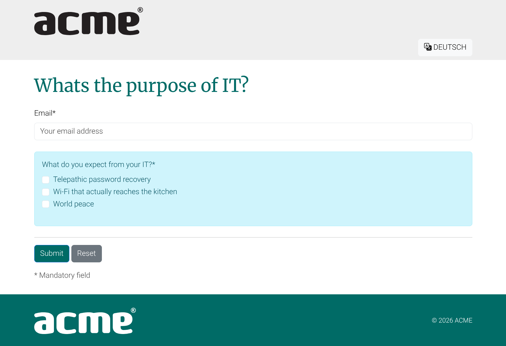

# Form Builder Documentation

```{toctree}
:caption: For editors
:hidden:

getting-started
faq
fields
```

```{toctree}
:caption: For developers
:hidden:

setup
```

User friendly html form builder. A customized Django Wagtail app. Wagtail as a standalone builder for form pages or simply forms.

```{include} snippets/wiphint.md
```

## Getting started

- [Getting started](getting-started)
- [FAQ](faq)



## Features

```{include} ../README.md
:start-after: Features
:end-before: Usage
```
